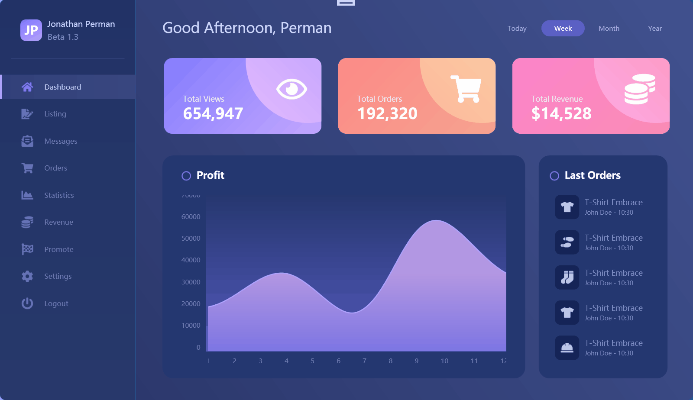
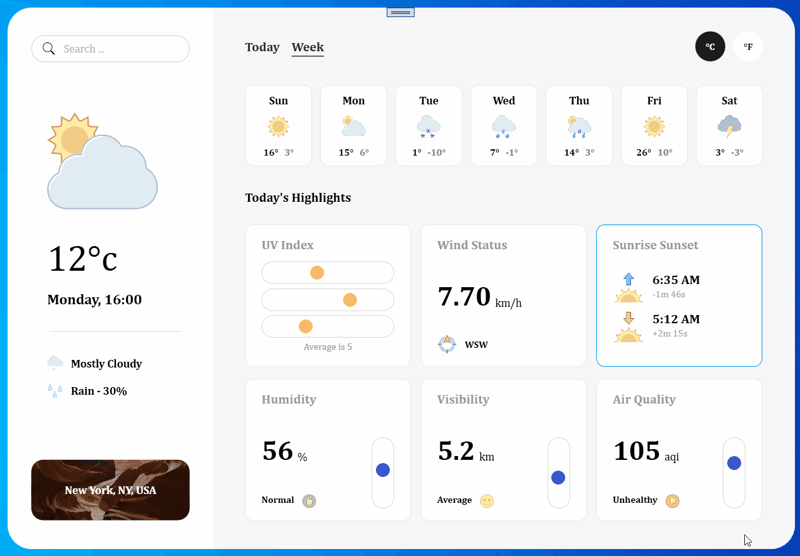

# WPFUISample

# Dark Admin Panel

**参考资料：**

- 视频地址：https://www.youtube.com/watch?v=PsqcLpDq9Vk&ab_channel=C%23WPFUIAcademy

**效果展示：**




**Nuget包说明：**

- [FontAwesome. Sharp](https://github.com/awesome-inc/FontAwesome.Sharp) 5.15.4

  - A library for embbeding Font Awesome icons in WPF & Windows Forms applications

  - 使用

    ```xaml
    xmlns:fa="http://schemas.awesome.incremented/wpf/xaml/fontawesome.sharp"
    ```

    ```xaml
    <fa:IconImage Icon="Home"/>
    ```

- [LiveCharts.Wpf](https://lvcharts.net/)  0.9.7

  - Simple, flexible, interactive and powerful data visualization for Wpf

  - 使用

    ```xaml
    xmlns:lvc="clr-namespace:LiveCharts.Wpf;assembly=LiveCharts.Wpf"
    ```

    

**技术要点：**

- 自定义控件
- Live Chart 图表
- Ellipses
- FontAwesome nuget


# Weather App

**参考资料：**

- 视频地址：https://www.youtube.com/watch?v=kvXbyCGObe4&ab_channel=C%23WPFUIAcademy

**效果展示：**




**技术要点：**

- 自定义控件